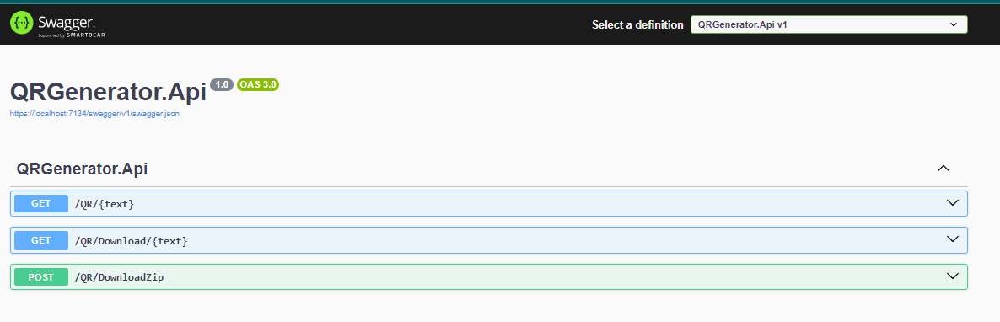
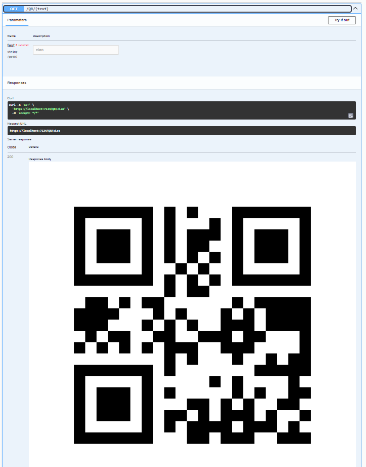
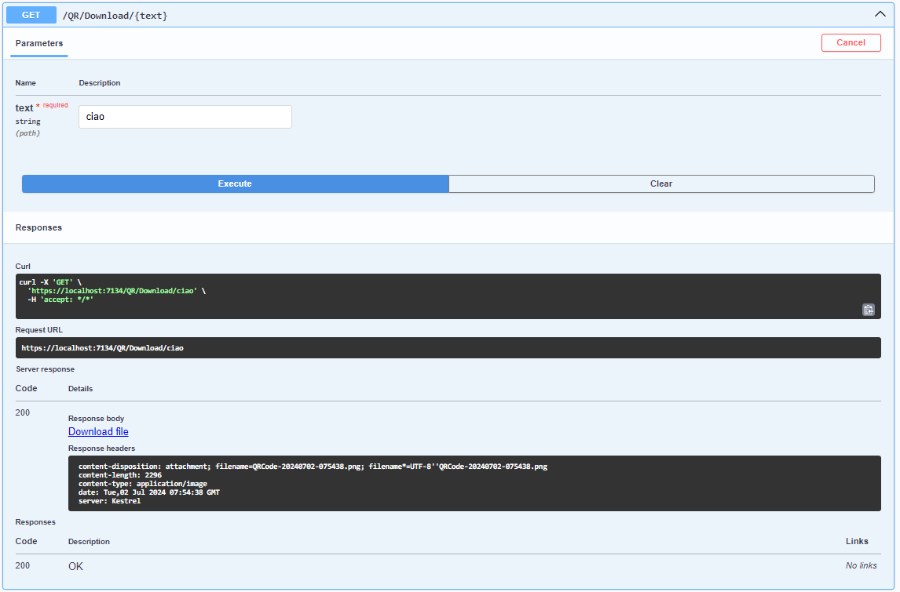
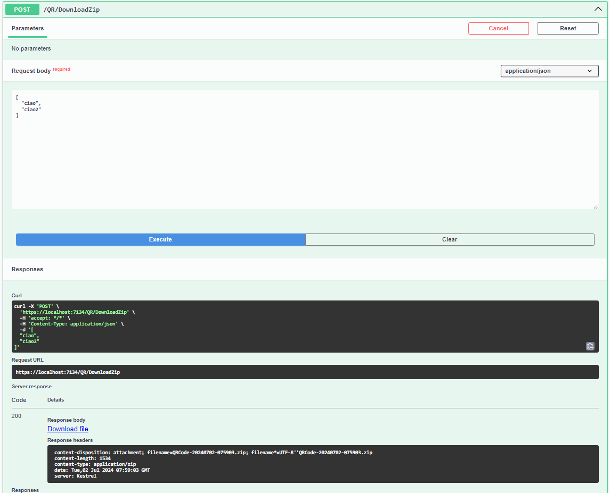
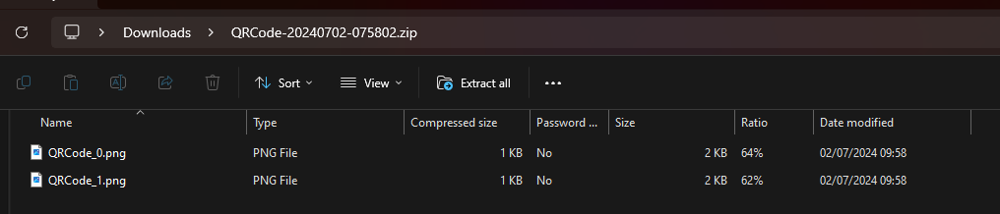

# QR Code Generation with .NET Core

This project serves as a basic example of how to use the QRCoder library in a .NET Core application to generate QR Codes, provide them for download, and handle multiple QR Code generations at once. 

It is based on a NuGet package called QRCoder, which can be found here: [QRCoder GitHub Repository](https://github.com/codebude/QRCoder).

This project exposes three endpoints:
- One that generates a QR Code from a text input.
- One that generates a QR Code and allows downloading it as a PNG file.
- One that takes a series of texts as input, generates QR Codes for each, and produces a zip file containing all the generated QR Codes.

Feel free to fork the repository and modify it to fit your specific use case.

## Application Flow

### Application Appearance

### First Endpoint: Generate a QR Code

This endpoint generates a QR Code from a provided text.

### Download PNG Endpoint

This endpoint generates a QR Code and provides the option to download it as a PNG file.

### Zip Download Endpoint

This endpoint accepts multiple texts, generates QR Codes for each, and produces a zip file containing all the generated QR Codes.

### Zip Content

An example of the contents of the zip file generated by the zip download endpoint.

## How to Run the Project

1. Clone the repository from GitHub.
2. Open the project in your preferred .NET IDE (e.g., Visual Studio, Visual Studio Code).
3. Restore the NuGet packages by running `dotnet restore`.
4. Build the project using `dotnet build`.
5. Run the project with `dotnet run`.
6. Open your web browser and navigate to `https://localhost:7134/swagger/index.html` to access the Swagger UI and test the endpoints.

## Dependencies

This project relies on the following dependencies:
- .NET Core
- QRCoder NuGet package
